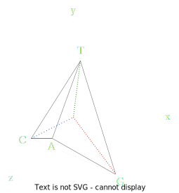

# BioSimplex

# BioMarkovChains

```@raw html

<p align="center">
  <br/>
  <i>Representing biological sequences as Markov chains</i>
</p>
```

```@raw html

<div style="text-align: center;">

<a href="https://camilogarciabotero.github.io/BioMarkovChains.jl/dev/"></a>
<a href="https://github.com/camilogarciabotero/BioMarkovChains.jl/releases/latest"></a>
<a href="https://zenodo.org/badge/latestdoi/665161607"></a>
<br/>
<a href="https://github.com/camilogarciabotero/BioMarkovChains.jl/actions/workflows/CI.yml"></a>
<a href="https://github.com/camilogarciabotero/BioMarkovChains.jl/blob/main/LICENSE"></a>
<a href="https://www.repostatus.org/#wip"></a>
<a href="https://pkgs.genieframework.com?packages=BioMarkovChains"></a>
<a href="https://github.com/JuliaTesting/Aqua.jl">
  
</a>

</div>

```


> A simple Julia package to convert BioSequences into a tethrahedral representation

This packages has a single public function `biosimplex` that takes a `BioSequence` and returns a *Simplex* representation of a *BioSequence*. The *Simplex* representation is a 3D representation of the *BioSequence* where each base is represented by a tetrahedron. The *Simplex* representation is useful for to generate a numerical representation of the *BioSequence* that can be used in machine learning models.

## Installation

<p>
BioSimplex is a &nbsp;
    <a href="https://julialang.org">
        
        Julia Language
    </a>
    &nbsp; package. To install BioSimplex,
    please <a href="https://docs.julialang.org/en/v1/manual/getting-started/">open
    Julia's interactive session (known as REPL)</a> and press <kbd>]</kbd>
    key in the REPL to use the package mode, then type the following command
</p>

```julia
pkg> add BioSimplex